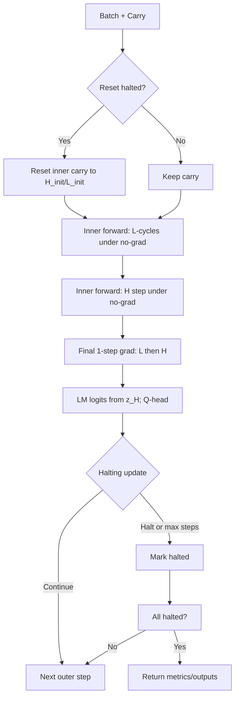

## HRM Implementation Deep-Dive

Reference paper: Wang et al., “Hierarchical Reasoning Model,” 2025. [PDF](https://arxiv.org/pdf/2506.21734)

### Overview
- This repository implements the paper’s Hierarchical Reasoning Model (HRM) with an Adaptive Computation Time (ACT) outer loop and two coupled recurrent reasoning modules operating at different timescales.
- Tasks: ARC-AGI/ConceptARC, Sudoku-Extreme, Maze 30x30. Data are converted into sequential grids and packed with minimal supervision (no CoT traces).
- Training uses a lightweight pipeline with Hydra configs, W&B logging, and two optimizers (Adam-like for dense params, SignSGD-like for sparse puzzle embeddings).

### Directory guide
- `models/hrm/hrm_act_v1.py`: Core HRM model with H/L modules and ACT wrapper.
- `models/layers.py`: FlashAttention-based attention, SwiGLU MLP, RoPE, RMSNorm, casted layers.
- `models/common.py`: Truncated normal initializer aligned with JAX behavior.
- `models/losses.py`: Loss head that wraps model forward; stablemax/softmax CE, ACT losses, metrics.
- `models/sparse_embedding.py`: Train-time sparse puzzle embedding with distributed SignSGD.
- `puzzle_dataset.py`: Iterable dataset, group-based sampling/packing and collate.
- `dataset/*.py`: Build scripts for ARC, Maze, Sudoku datasets.
- `pretrain.py`: Hydra entrypoint for train/eval loops, logging, checkpointing.
- `evaluate.py`: Standalone evaluation against saved checkpoints.
- `config/cfg_pretrain.yaml`, `config/arch/hrm_v1.yaml`: Default training and architecture configs.

### Model architecture

#### High-level structure
- Two reasoning modules:
  - H-level: slow timescale, abstract planning.
  - L-level: fast timescale, detailed computation.
- Each module stacks identical `HierarchicalReasoningModel_ACTV1Block`s: Post-norm Attention + SwiGLU MLP.
- Input injection: module input is added to hidden state each step (residual add) to enable conditioning.

```40:101:models/hrm/hrm_act_v1.py
class HierarchicalReasoningModel_ACTV1Block(nn.Module):
    def __init__(self, config: HierarchicalReasoningModel_ACTV1Config) -> None:
        super().__init__()
        self.self_attn = Attention(...)
        self.mlp = SwiGLU(...)
        self.norm_eps = config.rms_norm_eps
    def forward(self, cos_sin: CosSin, hidden_states: torch.Tensor) -> torch.Tensor:
        hidden_states = rms_norm(hidden_states + self.self_attn(...), variance_epsilon=self.norm_eps)
        hidden_states = rms_norm(hidden_states + self.mlp(hidden_states), variance_epsilon=self.norm_eps)
        return hidden_states

class HierarchicalReasoningModel_ACTV1ReasoningModule(nn.Module):
    def forward(self, hidden_states: torch.Tensor, input_injection: torch.Tensor, **kwargs) -> torch.Tensor:
        hidden_states = hidden_states + input_injection
        for layer in self.layers:
            hidden_states = layer(hidden_states=hidden_states, **kwargs)
        return hidden_states
```

#### Embeddings and states
- Token embeddings via `CastedEmbedding` and learned output `lm_head`.
- Optional puzzle-specific sparse embeddings (train-time writable, test-time read-only), concatenated as prefix tokens with learned/rope positions.
- Initial states `H_init`, `L_init` persisted as buffers; carry holds `z_H`, `z_L`.

```102:121:models/hrm/hrm_act_v1.py
self.embed_tokens = CastedEmbedding(...)
self.lm_head      = CastedLinear(...)
self.q_head       = CastedLinear(self.config.hidden_size, 2, bias=True)
...
if self.config.puzzle_emb_ndim > 0:
    self.puzzle_emb = CastedSparseEmbedding(...)
```

#### Hierarchical convergence inner loop
- Multi-timescale update: run L for `L_cycles` per H step, then H updates; most steps done under no-grad to realize deep latent computation economically; finally one gradient-carrying update.

```188:205:models/hrm/hrm_act_v1.py
with torch.no_grad():
    z_H, z_L = carry.z_H, carry.z_L
    for _H_step in range(self.config.H_cycles):
        for _L_step in range(self.config.L_cycles):
            if not ((_H_step == self.config.H_cycles - 1) and (_L_step == self.config.L_cycles - 1)):
                z_L = self.L_level(z_L, z_H + input_embeddings, **seq_info)
        if not (_H_step == self.config.H_cycles - 1):
            z_H = self.H_level(z_H, z_L, **seq_info)

# 1-step grad
z_L = self.L_level(z_L, z_H + input_embeddings, **seq_info)
z_H = self.H_level(z_H, z_L, **seq_info)
```

Outputs: `lm_head(z_H)` (drop puzzle prefix) and a 2-logit Q-head from the first token of `z_H` for halting decisions.

#### ACT outer loop and halting
- The wrapper tracks per-sequence `steps`, `halted` flags, and `current_data`. At each outer step it resets halted sequences’ inner carry to initial states, updates `current_data` for new sequences, forward-props inner model once, and updates halting based on Q-head logits with exploration and max-steps constraints. Optionally computes a bootstrapped target for the “continue” action.

```257:283:models/hrm/hrm_act_v1.py
new_steps = new_steps + 1
is_last_step = new_steps >= self.config.halt_max_steps
halted = is_last_step
if self.training and (self.config.halt_max_steps > 1):
    halted = halted | (q_halt_logits > q_continue_logits)
    min_halt_steps = (torch.rand_like(q_halt_logits) < self.config.halt_exploration_prob) * torch.randint_like(new_steps, low=2, high=self.config.halt_max_steps + 1)
    halted = halted & (new_steps >= min_halt_steps)
    next_q_halt_logits, next_q_continue_logits = self.inner(new_inner_carry, new_current_data)[-1]
    outputs["target_q_continue"] = torch.sigmoid(torch.where(is_last_step, next_q_halt_logits, torch.maximum(next_q_halt_logits, next_q_continue_logits)))
```

This implements the paper’s “latent reasoning” with “hierarchical convergence” and uses ACT-like halting selection learned via a simple Q-learning objective.

#### Losses and metrics
- `ACTLossHead` wraps the model and computes:
  - LM loss: stablemax or softmax CE for label tokens (ignores padding labels).
  - Q-halt loss: BCE against sequence-level correctness.
  - Optional Q-continue loss: BCE against bootstrapped target.
  - Metrics: token accuracy, exact sequence accuracy, Q-halt accuracy, steps.

```81:101:models/losses.py
lm_loss = (self.loss_fn(outputs["logits"], labels, ignore_index=IGNORE_LABEL_ID) / loss_divisor).sum()
q_halt_loss = F.binary_cross_entropy_with_logits(outputs["q_halt_logits"], seq_is_correct.to(outputs["q_halt_logits"].dtype), reduction="sum")
if "target_q_continue" in outputs:
    q_continue_loss = F.binary_cross_entropy_with_logits(outputs["q_continue_logits"], outputs["target_q_continue"], reduction="sum")
return new_carry, lm_loss + 0.5 * (q_halt_loss + q_continue_loss), metrics, detached_outputs, new_carry.halted.all()
```

#### Core layers and numerics
- Attention uses FlashAttention 2/3 if available; RoPE or learned positions; RMSNorm and SwiGLU MLP.
- Casted layers perform compute in minimal dtype (e.g., bfloat16) while preserving numerics with careful init and normalization.

```98:136:models/layers.py
class Attention(nn.Module):
    ...
    qkv = self.qkv_proj(hidden_states)
    qkv = qkv.view(batch_size, seq_len, self.num_heads + 2 * self.num_key_value_heads, self.head_dim)
    ...
    if cos_sin is not None:
        query, key = apply_rotary_pos_emb(query, key, cos, sin)
    attn_output = flash_attn_func(q=query, k=key, v=value, causal=self.causal)
    ...
```

### Sparse puzzle embeddings and optimizer
- `CastedSparseEmbedding` exposes per-batch local weights with gradient in training and writes back to persistent weights via a distributed SignSGD optimizer that deduplicates IDs across workers.

```11:39:models/sparse_embedding.py
class CastedSparseEmbedding(nn.Module):
    ...
    def forward(self, inputs: torch.Tensor) -> torch.Tensor:
        if not self.training:
            return self.weights[inputs].to(self.cast_to)
        with torch.no_grad():
            self.local_weights.copy_(self.weights[inputs])
            self.local_ids.copy_(inputs)
        return self.local_weights.to(self.cast_to)
```

```98:133:models/sparse_embedding.py
def _sparse_emb_signsgd_dist(...):
    if world_size > 1:
        dist.all_gather_into_tensor(all_weights_grad, local_weights_grad)
        dist.all_gather_into_tensor(all_ids,          local_ids)
    grad_ids, inv = all_ids.unique(return_inverse=True)
    grad = torch.zeros((grad_ids.shape[0], D), ...)
    grad.scatter_add_(0, inv.unsqueeze(-1).expand(-1, D), all_weights_grad)
    p = weights[grad_ids]
    p.mul_(1.0 - lr * weight_decay).add_(torch.sign(grad), alpha=-lr)
    weights[grad_ids] = p
```

### Data pipeline

#### Dataset format and loader
- Each dataset split is stored as .npy tensors: `inputs`, `labels`, `puzzle_identifiers`, `puzzle_indices`, `group_indices`; `dataset.json` holds `PuzzleDatasetMetadata`.
- The iterable dataset lazily mmaps arrays, constructs group-wise batches to fill the global batch size, pads locally, maps ignore labels, and yields tensors.

```53:71:puzzle_dataset.py
class PuzzleDataset(IterableDataset):
    def _load_metadata(self) -> PuzzleDatasetMetadata:
        with open(os.path.join(self.config.dataset_path, self.split, "dataset.json"), "r") as f:
            return PuzzleDatasetMetadata(**json.load(f))
```

```118:147:puzzle_dataset.py
def _iter_test(self):
    for set_name, dataset in self._data.items():
        total_examples = len(dataset["inputs"])
        ...
        yield set_name, batch, end_index - start_index
```

```151:188:puzzle_dataset.py
def _iter_train(self):
    rng = np.random.Generator(np.random.Philox(seed=self.config.seed + self._iters))
    group_order = np.concatenate([rng.permutation(dataset["group_indices"].size - 1) for _i in range(self.config.epochs_per_iter)])
    while start_index < group_order.size:
        start_index, batch_indices, batch_puzzle_indices = _sample_batch(...)
        ...
        yield set_name, batch, global_effective_batch_size
```

#### Dataset builders
- ARC: loads ARC-AGI/ConceptARC JSONs, applies dihedral/color permutations for augmentation, packs to sequences with PAD/EOS and translational augment for train.
- Maze: loads CSVs from hub; 30x30 char grids; optional augmentation via dihedral transforms.
- Sudoku: loads CSVs from hub; optional difficulty filter; optional band/stack/digit shuffles for augmentation.

### Training and evaluation

#### Configs
```1:32:config/cfg_pretrain.yaml
defaults:
  - arch: hrm_v1
...
data_path: data/arc-aug-1000
global_batch_size: 768
epochs: 100000
eval_interval: 10000
lr: 1e-4
...
```

```1:22:config/arch/hrm_v1.yaml
name: hrm.hrm_act_v1@HierarchicalReasoningModel_ACTV1
loss:
  name: losses@ACTLossHead
  loss_type: stablemax_cross_entropy
halt_exploration_prob: 0.1
halt_max_steps: 16
H_cycles: 2
L_cycles: 2
H_layers: 4
L_layers: 4
hidden_size: 512
num_heads: 8
expansion: 4
puzzle_emb_ndim: ${.hidden_size}
pos_encodings: rope
```

#### Launcher
- Hydra config loading and cross-rank broadcast of config and model params.
- Model built by string identifier via `utils.functions.load_model_class` and wrapped by the specified loss head.
- `torch.compile` is used by default (disable via `DISABLE_COMPILE`).
- Two optimizers configured; cosine LR with warmup applied to both.
- Train loop: forward with persistent carry, scale loss by global batch size, allreduce grads if distributed, optimizer step and zero_grad, metric reduction/logging.
- Eval loop: repeatedly call the model until all sequences halt, optionally save outputs per checkpoint.

```380:454:pretrain.py
@hydra.main(config_path="config", config_name="cfg_pretrain", version_base=None)
def launch(hydra_config: DictConfig):
    ...
    train_loader, train_metadata = create_dataloader(...)
    eval_loader,  eval_metadata  = create_dataloader(...)
    train_state = init_train_state(config, train_metadata, world_size=WORLD_SIZE)
    ...
    for _iter_id in range(total_iters):
        train_state.model.train()
        for set_name, batch, global_batch_size in train_loader:
            metrics = train_batch(...)
        train_state.model.eval()
        metrics = evaluate(...)
        if RANK == 0 and (config.checkpoint_every_eval or (_iter_id == total_iters - 1)):
            save_train_state(config, train_state)
```

#### Evaluation utility
- Loads `all_config.yaml` from checkpoint folder to reproduce config; attempts to load state dict whether wrapped by compile or not; runs the eval loop and prints metrics.

```34:51:evaluate.py
with open(os.path.join(os.path.dirname(eval_cfg.checkpoint), "all_config.yaml"), "r") as f:
    config = PretrainConfig(**yaml.safe_load(f))
...
try:
    train_state.model.load_state_dict(torch.load(eval_cfg.checkpoint, map_location="cuda"), assign=True)
except:
    train_state.model.load_state_dict({k.removeprefix("_orig_mod."): v for k, v in torch.load(eval_cfg.checkpoint, map_location="cuda").items()}, assign=True)
```

### Control-flow diagram


### Practical notes and gotchas
- FlashAttention 2/3 is required for speed; falls back appropriately but ensure CUDA and FA setup matches your GPU arch.
- Casting and initialization: parameters use truncated LeCun normal; compute largely in bfloat16; RMSNorm stabilizes activations.
- Puzzle embeddings are trained via a separate optimizer; ensure both optimizers receive scheduled LR each step.
- ACT halting uses exploration and a simple bootstrapped target; evaluation forces max steps for batch consistency; training can end early if all sequences have halted.
- Large `epochs` with `eval_interval` implement multi-epoch training per iteration to amortize loader overhead.

### Mapping to the paper
- Latent multi-step reasoning realized by many no-grad inner steps followed by a single grad step, amortizing compute while keeping optimization stable.
- Hierarchical convergence via L-then-H update scheduling and periodic reset of L after H updates through the ACT outer loop’s reset mechanism.
- No CoT supervision: labels are target grids; supervision is purely on final outputs; Q-learning trains a halting policy.

### Extending the repo
- New tasks: add a `dataset/build_<task>.py` that writes the standard .npy arrays + `dataset.json` metadata; then point `cfg_pretrain.yaml:data_path` to the generated directory.
- Model variants: create a new module under `models/` and refer to it via `config/arch/<name>.yaml:name` string identifier; adjust H/L cycles, layers, hidden size, and position encodings.
- Loss variants: implement new loss in `models/losses.py` and reference it by string path in arch config.

### References
- HRM paper: Wang et al., 2025. [PDF](https://arxiv.org/pdf/2506.21734)


